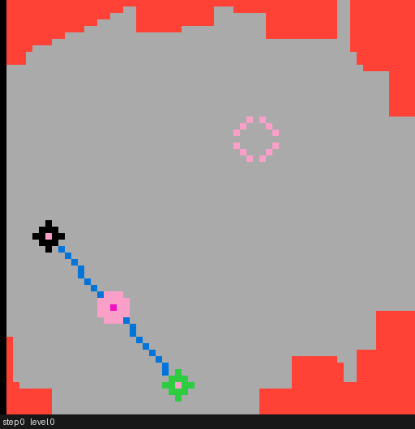
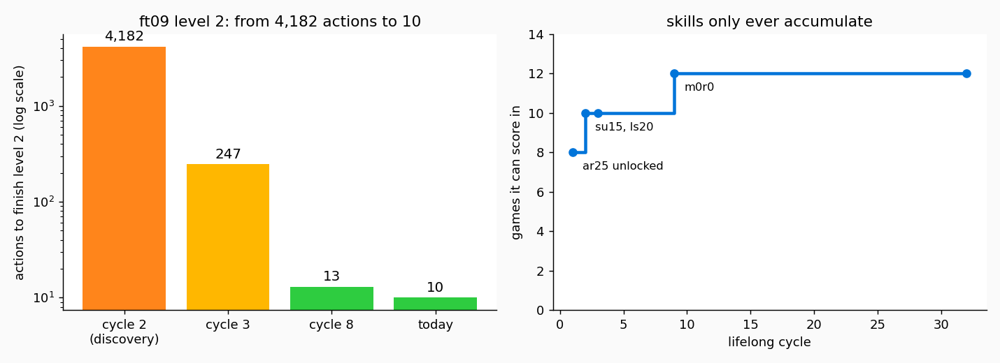
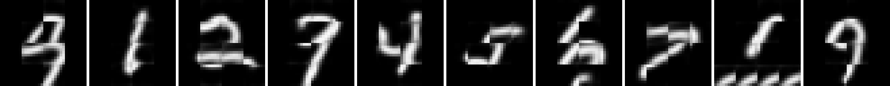
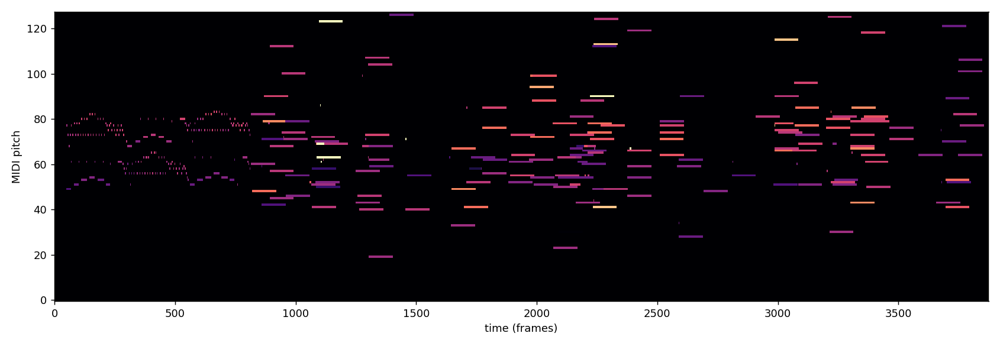

# clark-mind

**A little brain that learns video games and draws numbers — with no neural network training at all.**

No backprop. No gradients. No GPU. It learns the way you'd teach a stubborn but
honest accountant: by counting what happened, sleeping on it, and never
forgetting a trick that worked.

And here's the part we're most excited about: **everything in this repo was
built, measured, broken, diagnosed, and fixed by an AI research loop** —
hundreds of experiments where every change had to beat the previous version on
a benchmark before it stayed. The commit you're reading is the survivor.

---

## Watch it play

This is [ARC-AGI-3](https://three.arcprize.org) — a benchmark of little video
games where nobody tells you the rules. You get a screen, some buttons, and a
score. Frontier LLMs score under 0.4% on it.

The crosshair is where the brain clicks:



That run ends in a **LEVEL UP at step 50**. The first time it ever saw this
game, finding level 1 took it *thousands* of clicks. Now it remembers.

Here's the same story in one chart. On the game `ft09`, discovering level 2
took 4,182 actions. The next time it played: 247. Then 13. Today: **10 actions
for two levels** — faster than the human baseline for those levels.



The right-hand chart is our favorite thing about this project: the brain runs
in an endless loop (we just... leave it on), and the set of games it can score
in only ever grows. It has survived a multi-hour internet outage, dozens of
restarts, and days of continuous play without forgetting anything it learned.

## Watch it draw

The same codebase generates images. Ask it for digits and it draws them — not
by copying any single training image, but by predicting "what comes next"
patch by patch, the same way it predicts game states:



It also writes piano music with the same learner (different codec, same
brain):



And in [`one_mind.py`](one_mind.py), one single model does **all of it** — no
router, no if-statements deciding what a prompt "means":

```
GENERATE  "draw 7"        -> a picture of a 7
LANGUAGE  "name 5"        -> "five"
ACT       "play grid"     -> plays a real environment at 94% of its teacher's skill
DREAM     "play grid"     -> hallucinates a plausible game it isn't playing
```

The acting part is the fun one: the fast game-playing agent lives a life, its
experience gets fed into the same model that learned to draw, and afterwards
the model can *play by predicting what a competent life looks like*. (That's
roughly the hippocampus → cortex story from neuroscience, and it fell out
naturally here.)

## How it works, in plain words

The whole thing is built on one idea: **count things, and when you're unsure,
zoom out.**

- **Memory**: a table of "in this situation, this click did that." Exact,
  fast, honest. This is the hippocampus.
- **Zooming out**: every situation is stored at several resolutions — exact
  pixels, object layout, object inventory. Never seen this exact screen? Ask
  the blurrier version of it. (This is just n-gram backoff, wearing a lab
  coat.)
- **Sleep**: every couple thousand steps it consolidates — replays its
  memories to propagate value, then evicts stale junk. Skills are protected
  for life: anything that ever scored, and anything on a path to a score,
  cannot be evicted. The brain stays ~25MB forever no matter how long it runs.
- **Boredom (the best part)**: cells on screen that change *no matter what you
  do* — move counters, HUD bars, blinking decorations — get detected and
  ignored. A cell is a "clock" if its changes don't depend on what action you
  took. Without this, one ticking counter makes every screen look brand new
  and the poor thing can never learn anything. We proved it on a toy world:
  one counter pixel takes the agent from perfect score to *zero*, and the
  habituation rule restores it to perfect.
- **Curiosity**: before it has ever scored, all it wants is information — it
  sweeps systematically, like solving a maze on graph paper. After the first
  score, value takes over.

There's also a fully Bayesian rewrite of the agent
([`bayes_agent.py`](bayes_agent.py)) with zero hand-tuned constants — every
exploration decision derived from posterior sampling. It *beats* the
production agent on every toy benchmark (near-perfect on the reskinning test
where the heuristic version gets 83%), but it's currently ~50× too slow for
the big games. Classic.

## The honest scoreboard

We are not going to pretend this thing is AGI:

| | clark-mind | frontier LLMs | humans |
|---|---|---|---|
| ARC-AGI-3 efficiency score | **0.87%** | 0.25–0.37% | 100% |
| games it can score in | 12 / 25 | — | 25 / 25 |
| deepest level reached | 2 | — | all of them |
| remembers what it learned | forever | no | mostly |
| can re-do a solved level | superhuman speed (3–13 actions) | — | 7–55 actions |

So: it beats frontier LLMs on this benchmark's efficiency score (with caveats —
different evaluation splits, and it gets to keep its memories), and it is
nowhere near humans. Its superpower is *never forgetting*; its weakness is
that it can't look at a puzzle and reason out the rule. It finds rules by
trying things — then keeps them forever.

## The autoresearch part

This project was developed by an AI (Claude) running a research loop:

1. run the full 25-game benchmark
2. find the worst failure in the data
3. diagnose it down to a mechanism (with targeted probe experiments)
4. implement the smallest generic fix — *no special cases allowed*
5. re-run everything; keep the fix only if nothing else regressed

Nine benchmark generations of that loop took the score from 0.01% → 0.87%.
Every mechanism above exists because a specific, measured failure demanded it:

- the **sleep system** exists because brains were growing without bound
- **clock masking** exists because one game's move-counter made every state
  look new (we literally dumped the screen and found the bar ticking)
- the **Markov score fix** exists because the agent discovered it could farm
  level 1 forever — 1,300 level-ups in one session — and we had to make
  re-completions worthless (same lesson three different ways: if your reward
  isn't honest, the agent *will* find out)
- **"stay in fresh territory"** exists because we autopsied why the agent kept
  walking *out* of newly-discovered levels (all its plans led home)

The full lab notebook of every experiment, dead end, and pathology lives in
the code comments and docstrings — they're written as findings, not
decorations.

## Brain primitives: fetch, search, settle (all backprop-free)

A counting machine can't reach back, search, or satisfy constraints. A brain
does all three without gradients, so we added the math:

- **Non-local fetch** (`assoc_memory.py`) — a Hebbian content-addressable
  memory. Modern Hopfield networks *are* attention (`softmax(βKq)·V`), but the
  memory is stored by *writing*, not backprop. This is attention without
  gradients. Proof: DNA→RNA transcription and reverse-complement in their
  natural separated form went from **0% → 100%** — the model fetches the
  aligned base instead of needing it adjacent.
- **Global search** (`search.py`) — verifier-guided best-first search:
  propose, score with the checker, expand, backtrack. The verifiable reward is
  the value signal. Solves the protein-folding task below.
- **Constraint satisfaction** (`search.py:relax`) — iterative local
  consistency to a fixed point (AC-3 flavour), gradient-free.

## Science it can actually do (`science.py`, all verifiable)

```
BIOLOGY    transcription / reverse-complement / codon->protein   100%
CHEMISTRY  molar mass (H2O=18, glucose=180, ...)                 exact
FOLDING    2D HP-lattice protein folding via search    optimal for short
           chains (verified vs brute force), degrades with length
```

Honest line: it does the *lookups and local procedures* of science (genetic
code, complements, mass accumulation) and *searches* the hard combinatorial
ones (folding) — it does not reason them out. That's the brain we built.

## One compounding brain (`brain.py`, `primitives.py`)

All learning goes into *one* shared model, and it compounds — but only the
right way, which we measured:

- **Accumulation, no forgetting**: one model holds addition + multiplication +
  the genetic code at 100% each. Counts add, they don't overwrite — so unlike a
  backprop net, it never catastrophically forgets.
- **Transfer needs *identical* primitives, not similarity**: co-training
  addition with multiplication (similar-looking, different-meaning steps)
  *hurt* by 10 points. But the single-digit carry fact, which multi-digit
  addition literally *is* a chain of, transfers **+100 points** (multi-digit
  addition works at 100% with zero multi-digit examples).
- **So we built a primitive library**: a registry of atomic shared ops
  (`a` digit-add, `m` multiply-accumulate, `p` complement, `r` transcribe,
  `g` codon), each learned once into one brain. Every skill is a *composition*
  of primitive queries:

```
taught 1,272 atomic primitive facts, ZERO full-skill examples:
  add (4-digit)        100%   [composes 'a']
  multiply (x4-digit)   94%   [composes 'm']
  transcribe (40 base) 100%   [composes 'r']
  rev-complement       100%   [composes 'p']
  translate protein    100%   [composes 'g']
  NEW skill "sum a list" reusing 'a', no new training: 100%
```

Learning a primitive benefits every skill that composes it; new skills that
reuse primitives are free. That's how the brain compounds — backprop-free.

## What's in the box

```
predictive_agent.py   the generic agent: counts, multi-resolution backoff,
                      sleep/lifelong memory, clock habituation + its proof gates
micro_cortex.py       the generalizing micro-feature learner (SARSA(λ), local)
clark_arc_agent.py    the ARC adapter: object segmentation, retina, rewards
bayes_agent.py        the heuristic-free rewrite (hierarchical PSRL) + gates
arc_bayes.py          ARC adapter for the Bayes agent
one_mind.py           ONE model that draws, names, perceives, acts, dreams
mind.py               the front door: route any prompt to the right faculty
psc_studio.py/_omni   the generation substrate (images, music, multimodal)
psc_image_gen/_music  codecs the studio builds on
arc_record.py         film any game with any brain -> GIF
arc_report.py         official-style RHAE scoring for benchmark logs
outputs/run_benchmark.sh   25 games x 2 passes, tagged brains
outputs/run_forever.sh     the lifelong loop (stop: touch outputs/STOP)
docs/                 design notes + the legacy no-backprop prototypes
```

## Run it

```bash
# talk to it (one front door for everything)
python3 mind.py "make an image of a 7"
python3 mind.py "play ft09 for 2000 steps"
python3 mind.py "status"

# the one-model-no-router demo
python3 one_mind.py

# the agent's proof gates (GridWorld + reskinning + clock + lifelong memory)
.venv-arc/bin/python predictive_agent.py

# leave it learning forever (stop with: touch outputs/STOP)
zsh outputs/run_forever.sh
```

Requirements: Python 3.12 with `numpy` and `arc-agi` for the games
(`.venv-arc`), plus `PIL`/`torchvision`/`pretty_midi` for generation.
Older no-backprop prototypes that led here are documented in
[`docs/LEGACY.md`](docs/LEGACY.md).

---

*No backprop was used in the making of this brain. Counts, sleep, and
stubbornness only.*
